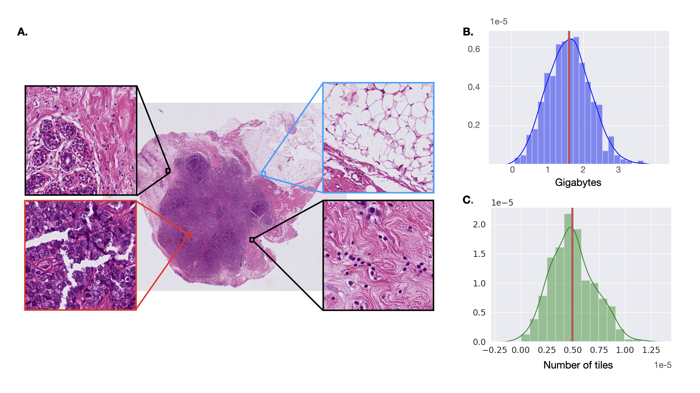

# Biological and methodological challenges

### Biological motivation :  the prediction of the Homologous recombination deficiency (HRD)

Breast cancer is a very heterogeneous disease with four major molecular classes (luminal A, B, HER2 enriched and triple-negative) 
each of which benefiting from different therapeutic approaches figure.
Early breast cancer patients benefit from an overall survival of 70 to 80%. However, the advanced stage with metastatic disease is incurable.

On average, a human cell undergoes 10 double-stranded breaks in its chromosomes.
If these breaks occurs in important regions such as for example an anti-oncogene, if they are not repaired, can lead to carcinogenesis.
The homologous recombination pathway is one of the three main celular processes that aim at repairing double stranded lesions of the DNA.
It occurs in up to 50% of triple-negative breast cancers, and in up to 18% of breast cancer all molecular classes combined [@turner_signatures_2017]

Many proteins take place in the formation of the complex responsible for the double-stranded DNA repair: BRCA1, BRCA2, RAD51C or PALB2 for example.
Thus, the paths leading to HRD are mutliple, and can be etiher acquired in a hereditary context or in the tumor during carcinogenesis.
The majority of hereditary BRCA1 cancers are triple negative (TN) and 50 to 60% of TN harbor a genomic profile of HRD. 
HRD also exists in luminal B [@manie_genomic_2016] or HER2 [@ferrari_whole-genome_2016] tumors associated with hereditary BRCA2 mutations or in a sporadic context.
This defect is therefore difficult as its causes are multiple and even for some cases unknown.

As evoqued, HR pathway is not the only double-stranded DNA repair pathway [@rodrigues_ciblage_nodate],
there is also the Non-homologous end joining (NHEJ) and the alternative end-joining (AltEJ).
The latter can be targetted by various drugs such as PARPi or platinium salts, in an inhibition purpose. 
The cells that accumulate the defect of both HR and AltEJ would suffer from too many DNA default and eventually die, and these cells are supposed to be the cancerous cells !
Therefore, PARPi and platinium salts are promising drugs in the treatment of HRD tumors, and already have documented proven effects [@tutt_carboplatin_2018].

BRCA1 and BRCA2 mutations are predictive markers for response to PARPi [@paluch-shimon_targeting_2019]  and platinum salt [@tutt_carboplatin_2018].
In that context, the screening for BRCA1 and BRCA2 mutations for all luminal B and triple negative breast cancers,
that represent 35% and 15 to 18% of all breast cancers, respectively, is a real challenge in clinical practice.

![\label{Origins} of the HRD. Adapted from [@turner_signatures_2017]. NST: Non special type. IHC: Immunohistochemistry. TILs: Tumor Infiltrating Lymphocytes. LB: Luminal B](figures/bio_hrd.png)

Furthermore, no specific morphological patterns or phenotypic characteristics distinguish carcinomas with HRD
as a result of either germline or somatic BRCA1/2 mutations in one hand and HRD due to other mechanisms (BRCA1 methylation, RAD51C mutation...) in the other hand.
Similar as for lung [@coudray_classification_2018], mesothelioma [@courtiol_classification_2018], gastrointestinal [@kather_deep_2019], [@schmauch_deep_2020] tumors,
the development of machine- learning models could predict clinico-molecular characteristics of breast tumors from digitalized slides. 

> The aim of this study is to predict HR status from digitalized slides of breast tumors (triple negative and luminal B breast cancer)
> using a machine learning approach in order to identify patients more prone to have an HRD defect 
> and to help to better select patients for indications of PARPi and platinum salts.
> This is a **binary classification** problem.

HRD, because of its diverse possible origins, is a challenge to measure precisely.
The most precise way of doing so is by conducting functional genomic analysis on in-vitro cell-lines : nothing close to a possible clinical application.
However some proxy measurement have been created, validated by functionnal analysis ([@birkbak_telomeric_2012], [@abkevich_patterns_2012]).
The measure we use as an approximation of the HR state has been developed by a team of the Curie Institute [@popova_ploidy_2012].
It is based on SNP arrays -the DN being taken from frozen tisue-, and measures the number of Large Scale state Transition (LST)
present which are clues of an inappropriate recombination between chromosome segments. 
The HR binary status is infered from this measure (threshold at 20 LST): a high LST is associated with HRD whereas a low LST is associated with HRP.
This measure is applicable in a clinical context, by preleving DNA from frozen tissue samples, and therefore this is this variable that we aim to predict.
In the latter, we will refer to the HRD status as LST-status, but it is important to keep in mind this approximation, that may lead to "noisy" labels.

### The Whole slides Images : a non-standard input.

To make or confirm the diagnosis of a cancer, a microscopic analysis of ill tissues and cells is prepared and investigated by expert pathologists.
This analysis is performed on a sample of tissue (taken from a biopsy or during a surgical operation) that is stained and mounted on a glass-slide.
These slides are prepared in routine in a department of pathology, and usually examine under the microscope.
Eventually, it is possible to use a digital slide scanner to numerize the sample.
These images are called Whole Slide Images (WSI) and are the object of study in computational pathology. 
Fortunately, thanks to the rise of computational pathology and recently deep-learning techniques, 
this last step of scanning is increasingly done in hospitals, giving rise to bigger and more complete diseases datasets.

\paragraph{General carachteristics of WSI} A WSI is usually scanned at a magnification `40X` or `20X`. 
This magnification leads to huge images: an example of a WSI as well as their typical sizes can be seen on figure \ref{dataset}.

This size leads to several constraints that we had to overcome in order to do image analysis and apply machine learning algorithm:

1. The whole image hardly fits in memory. 
    * A specific library has to be used to process such objects (`openslide` or `pyvips`).
    * We have to cut a WSI into small images of the same size that are named **tiles**. A WSI is, on average, composed of **50000 tiles at the highest resolution**.
2. The signal-to-noise ratio is particularly small. As exemplified in figure \ref{dataset} A. : whereas some instances are interesting for pin-pointing a diagnostic (red tile), 
    a lot more are useless and add noise to the overall image (blue tile).
3. The many-steps protocole to create a WSI leads to as many possible ways to incorporate biases in them. Taking care of these biases is fundamental when treating such datasets.

Because of these particularities, we cannot apply candidly the classical image processing algorithm on WSI.

\paragraph{Slide creation protocole and caveat}

As points `1.` and `2.` are methodocological challenges (in term of algorithm and computation), point `3.` is more practical. 
To understand precisely the bias we sould care about and develop an intuition about them, 
I wil here quickly describe how a whole slide is created.
As described in [@azevedo_tosta_computational_2019] there is 7 steps in the creation of a slide: 
**collection**, **fixation**, dehydration and clearing, paraffim embedding, microtomy, **staining** and mounting.
The collection describes the way the tissue sample is preleved (biopsy or surgical prelevement).
The fixation aims at stopping biochemical reactions in the tissue and therefore preserve it.
dehydration and clearing aim at drying the sample for it to be cut easily, the paraffin embedding as well.
The sample block is then cut into thin slides, this is the microtomy (a precise machine is used to do that). Finally the 
sample is stained with particular dies, that are supposed to highlight specific tissue components. 
The samples are eventually mounted on glass slides.

The **bolded** steps are the steps that can lead to a systematic bias. Other steps are quite 

WSI processing and learning is actually an active research field, and I will try to summarize the different methods developed in the litterature.

## WSI processing: a litterature review

As mentioned previously, the most natural way of processing a WSI is to cut it into small, more bearable pieces: the tiles.
In my implementations, a tile is an image of  `256x256` pixels.
By doing so, if we do not consider the spatial distances between tile, a WSI can be represented by the set of its composing tiles.
The machine learning task -which is to classify a WSI between HRD and HRP- therefore shrinks to classifying a set of tiles.
This problem of classifying sets of instances has been known for a while by the machine learning community as the **multiple-instance learning** problem. 
It provides a theoretical and practical framework for solving the WSI classification problem.
In the following, I will introduce the multiple-instance learning problem, then present how its development has been used and adapted to the WSI classificaton task.
In a third time, I will present the limitations of the methods drawn from this framework and present a few methods that do not fit within it.

### The multiple instance learning (MIL) problem.

The multiple instance learning problem is a supervised machine-learning problem with a **weak supervision**.
The weak supervision regime can describe different supervision regimes, as the review of Zhou summarizes it [@zhou_brief_2018]:

1. Incomplete supervision: only part of the available data is labeled, and this part is usually not big enough to train a good learner.
2. Inexact supervision: the given supervision is concerning only a small part of the input.
3. Innacurate supervision: the given supervision is noisy. It may suffer from errors.

The standard MIL problem aims at classifying a *bag of instances* or *bag of feature vectors* instead of a single *feature vector*.
The supervision associates one bag with one label and we know that only some of the instances contained in the bag are responsible for the label
(making the other instances *wrongly* associated with the label). 
It therefore lays within the second supervision regime that have been mentioned. 
However WSI classification problems usually have a supervision information sharing the characteristics of all the three points. 
^[**1.** Labels are very costly to obtain -LST signature for example- whereas images that are taken in routine, are available in substancial quantities. 
**3.** In many problems, the annotation is done by experts and suffers a part of subjectivity.]

This setting is fitted to many tasks such as for example drug activity classification.
Let's say for instance that we want to predict the effect of a molecule from its different spatial conformations, 
it is natural to represent one drug as the bag of its possible spatial conformations.
Consequently, the purpose of multiple instance learning is to find which instances are important for the classification task, 
and aggregate them appropriately.

\paragraph{The standard MIL assumption} In the case of the prediction of the effect of a molecule,
if one of the conformation of a molecule has an effect, then the molecule itself has an effect.
Therefore, if we make the assumption that each instance have a (hidden) label, then the relationship between the bag label and the instances labels is 
straightforward! If we set as `1` the label "has an effect", the label of the whole bag is exactly the maximum of the instances labels.

This assumption is called the **standard MIL assumption**.
As done in the review work of Foulds [@foulds_review_2010], we formalize the problem (and set here the notation
for the following of the report).

We set $X = \{x_1, ..., x_n\}$ to be a *bag* object containing $x_i \in \mathcal{X}$ instances.
$\mathcal{X}$ is the feature space in which instances are embedded, usually $\mathcal{X} = \mathbf{R}^f$.
The standard MIL assumption has been stated to solve a binary classification; therefore let 
$\Omega=\{+,-\}$ be the label space.
As said previously we hypothesize that it exists a (unknown) function $g: \chi \rightarrow \Omega$ that maps each instance to its hidden label.
We are looking for a function $\nu: \mathbb{N}^{\chi} \rightarrow \Omega$, called the *concept*, that will map a bag of instances to its label.
The concept specify the relationship that exists between the instances labels and the bag label.

Following the standard MIL assumption, and given the $\vee$ is the `OR` operator,  we have the equivalency relationship : 

$$\nu(X) \Leftrightarrow\left(g\left(x_{1}\right) \vee g\left(x_{2}\right) \vee \ldots \vee g\left(x_{n}\right)\right)$$

This assumption is really well suited to the molecule activity prediction task. It may also be adapted for some of the Whole Slide Images tasks.
For instance, if the classification problem is to classify a WSI as cancerous, 
then it is common sense to classify the WSI as cancerous if we can find inside it 
a patch containing cancerous cells.

However the concepts that can be leveraged by this assumption may not be rich enough to solve other tasks.
Just consider for example the classification problem of grading a tumor. One of its key features is the mitotic index, that is, 
the count of cells in a division state, inside the tumor. One tile containing a mitose won't be enough to classify a WSI as high-grade ! 
In these case we could need a more broader concept $\nu$, for example a concept based on a count of instances : 

$$ \nu(X)  \Leftrightarrow \Sigma\mathbf{1}_{\{g(x_i) = +\}} > s$$

Where `+` is the label associated to an instance containing a mitotic figure, and $s$ a threshold fixing the shift between high and low grade tumors.
Foulds et al. [@foulds_review_2010] review the possible MIL assumptions, that shaped the different solutions of WSI classification.

\paragraph{From standard MIL to WSI-MIL}
If we want to predict wether or not a tissue slide is cancerous, then the standard MIL assumption is the exact 
hypothesis to do. We can draw from this a general framework to solve the WSI classification problem. 
If we follow the logic of the standard MIL assumption, in order to output a WSI prediction, we will need three functions:

1. One function $\mathcal{F}$ that will classify the *instances*.
2. One function $\mathcal{P}$ that will aggregates the instances predictions, the *concept*.
3. Finally a function $\mathcal{C}$ that will generate a prediction from the concept, and therefore classify the whole bag.

The compositions of the three functions creates a concept and classify it.
$$\mathcal{C} \circ \mathcal{P} \circ \mathcal{F}(X) = \hat{y} \in [0,1]^C$$
with $C$ being the number of classes.
If `2.` is the $\max$ function and `3.` is the identity, the concept is the one of the standard assumtion.
We can see that if $\mathcal{C}$, $\mathcal{P}$ and $\mathcal{F}$ are derivable, then we can compute a classical classification loss 
$L(X) = L(y, \mathcal{F}(X)) = L(y, \hat{y})$, $y$ being the label of $X$,
and optimize the parameters of each of this function using the Stochastic Gradient Descent (SGD) algorithm.

In the case of a *more general* WSI classification problem, we would prefer to use a *more general* assumption than the standard one
(or even the "counting" assumption cited above).

> The generalization of the standard MIL assumption provides a framework for innovation
> and most of the algorithm that have been developed for WSI classification aim at improving one of the three presented functions, or several ones independantly.

The work by Campanella et al. [@campanella_clinical-grade_2019], that is currently the work applying a MIL algorithm to the largest WSI database, use
a slightly modified version of the standard MIL algorithm.
They set $\mathcal{F}$ to a ResNet (a standard convolutional neural network architecture) that outputs a score (which can be interpreted as a classification score).
The concept $\mathcal{P} = \text{argmax}_{x_i}\mathcal{F}(x_i)$ picks the best scoring tile of the WSI, and they finally generate the slide-level prediction score 
with an other ResNet ($\mathcal{C}$). In a second step, they freeze $\mathcal{F}$, set $\mathcal{P} = \text{top-k}_{x_i}(\mathcal{F}(x_i))$ and learn $\mathcal{C}$ as a reccurent neural network,
that aggregates the top-k tiles according to the $\mathcal{F}$ scoring function.
This last step is reported to add robustness to the results.

The work by Courtiol et al. [@courtiol_classification_2018] develops a MIL algorithm by changing mostly the $\mathcal{P}$ concept function, that is the pooling function.
$\mathcal{F}$ is here again a ResNet. This time, as Campanella and team did, they choose
$\mathcal{P} = (\text{top-k}_{x_i}\mathcal{F}(x_i), \text{low-k}_{x_i}\mathcal{F}(x_i)) \in \mathbf{R}^{2k}$ as the pooling function.
$\mathcal{C}$ is parametrized as a Multilayer perceptron. 
Courtial and his team have been inspired by the work from Durand et al. [@durand_wildcat:_2017],
where they show that using *negative* instances in the final prediction is beneficial to the overall classification.
This seems pertinent in natural images classification (if in a maintain scene a girafe is present, it should be normal to have the instance `girafe` decreasing the bag probability of being a mountain scene). 
however often, depending on the way WSI are tiled, the worst scored tiles are artifacts usually associated with the preparation of the sample (badly focused or inked regions for example).

The proposition of Ilse et al. [@ilse_attention-based_2018] is by far the most popular one and is in many papers the baseline to compete with.
This work focus on the pooling function: on the contrary to the two previous method, Ilse proposes in this work to *learn* this pooling function.
$\mathcal{F}$ is a parametrized by a neural network that outputs not one score, but a low dimensional embedding of the input.
Then the pooling function $\mathcal{P}$ is a weighted sum of these low dimensional embeddings, the weights being the output of a neural networks
(parametrized by $\mathbf{V} \in \mathbb{R}^{L\text{x}M}$ and $\mathbf{W} \in \mathbb{R}^{L\text{x}1}$).

$$\mathcal{P}(\mathcal{F}(X)) = \sum_{i=1}^{N} a_{i} \mathcal{F}(x_i)$$

with

$$a_{i}=\frac{\exp \left\{\mathbf{W}^{\top} \tanh \left(\mathbf{V} \mathbf{h}_{i}^{\top}\right)\right\}}{\sum_{j=1}^{N} \exp \left\{\mathbf{W}^{\top} \tanh \left(\mathbf{V} \mathbf{h}_{j}^{\top}\right)\right\}}$$

This brings flexibility to the framework: the pooling function can then be closer to the `max` function or closer to the `mean` function depending on the problem.
It is suited (theoretically) to solve a broader range of MIL assumtions.

All of these algorithm share also the same interest of being easily **interpretable**.
In fact, in each of them,  tiles participates in the bag representation in proportion to the score that is output, either by $\mathcal{F}$ or $\mathcal{P}$.
These scores may therefore serve as a key for interpreting the prediction, by extracting the most important tiles or creating heatmaps of "importantness".

Finally, many other work produced variations of the presented algorithm, mainly by adapting the pooling function to the task or data available
[@li_dual-stream_2020], [@gildenblat_certainty_2020], [@bhattacharjee_pooling_2020].

To conclude, multiple instance learning provides a good rational to solve the WSI classification problem. 
However it seems like the MIL-based solution have been adopted mostly because of the resemblance between a tiled WSI and the bag of instance used in MIL.
On the contrary to the set of molecule conformations described earlier, the set of tiles that compose a WSI are spatially related.
In the previous implementations, the image nature of the WSI is not taken into account;
more than that, the MIL pooling function have been specifically developped to be permutation invariant ([@zaheer_deep_2018], [@sannai_universal_2019]), 
meaning that the spatial relationship between instances is purposely disregarded in these models.

Fewer works are focusing on treating the WSIs not as a bag of instances but as an image. 
In the article of Pinckaers et al. [@pinckaers_streaming_2019], succeed in applying a classical CNN on very large portions of WSI.
By streaming these very large images (8092x8092 pixels) through the CNN and reconstructing the activation maps during the stream, they have been able 
to achieve very good results on the *CAMELYON16* benchmark dataset. 
This engineering *tour de force* allowed them to process images that would require GPU units with 825Gigabytes of memory (per batch) in the classical framework, without significant loss in the performances.
Saliency maps can moreover be extracted to help the interpretation of the classification results.

An other work by Tellez et al. ([@tellez_neural_2019], [@tellez_extending_2020]) took the side of applying a convolution after the *compression* of the WSI.
As in the previous works, a WSI is first tiled. These tiles are used to train an unsupervised representation learning algorithm 
(this paper providing, beside its compression idea, a comparative study of three unsupervised learning algorithm in the histopathology context).
The encodings extracted from them, of a lower dimension than the initial tiles, are then stacked according to their place in the initial WSI.
Finally a CNN is used on top of this compressed version of the WSI for classification purposes.

While these two last proposition are adressing the lack of contextual information of the various MIL algorithms, 
they still share some drawbacks. The implementation of the first solution is not part of the usual deep-learning libraries,
consequently making further development and innovation hard and less flexible. 
Both of them need the input WSI to be cropped to a standard size, and therefore cannot appropriately account for the high diversity in high and shape of the slides.
Finally, we expect the lack of spatial context of MIL models to bring somehow a plus for training with a small dataset. 
In fact, the shape and surface area of the tissue in the slides are a great variability factor that, we think, would easily cause overfitting.

In the next part of this report I will present the model I used and improved, as well as the results I obtained on several classification problems.

Dont forget to evoke when presenting my model :
    - the problem of Attention DEep mil for interpreting the scores (if the instances representation do not share the same magnitude)
    - The way I changed the model in order to improve interpretation (peut etre qu'une normalisation futée à la fin de la représentation de basse dimension serait suffisant pour régler le pb ?)
    - Develop the instance-dropout part (re-launch experiments on big dataset of challenge)
    - creates T-sne representation of each head of attention

### Biological Motivations

Describe here the HRD-BRCAness problem.

## The developed solution:

### Features extraction

### Multiple-instance learning model

### Results

#### HRD
#### standard variables (grade etc...)
#### Challenge

## Perspectives

# Introduction to WSI classifications

#
